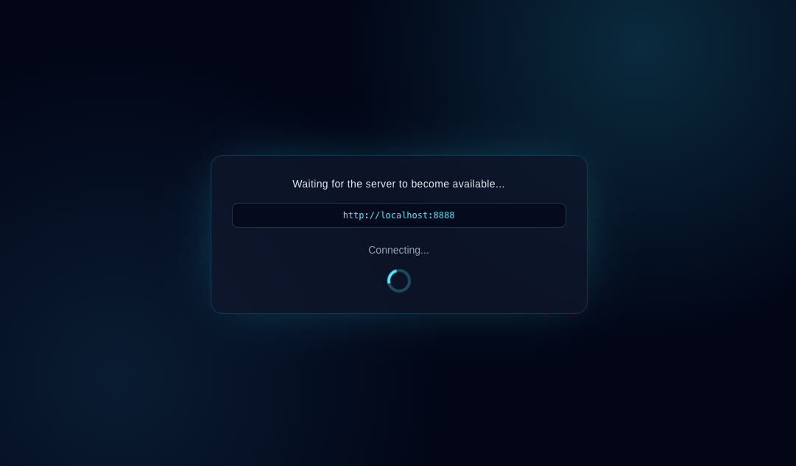

# Greenlight 🟢

Greenlight is a tiny single-file web app that waits for a target URL to become reachable and then redirects the browser to it.



## Usage

Open the page with a query string like:

```text
?url=https://example.com&w=100%&o=0px
```

Parameters:

- `url`: the URL to monitor and redirect to
- `w`: optional width for the page container
- `o`: optional horizontal offset for the page container

## Development

Install dependencies:

```bash
npm install
```

Start the development server:

```bash
npm run dev
```

Build the production bundle:

```bash
npm run build
```

The build output is emitted to `dist/`.
